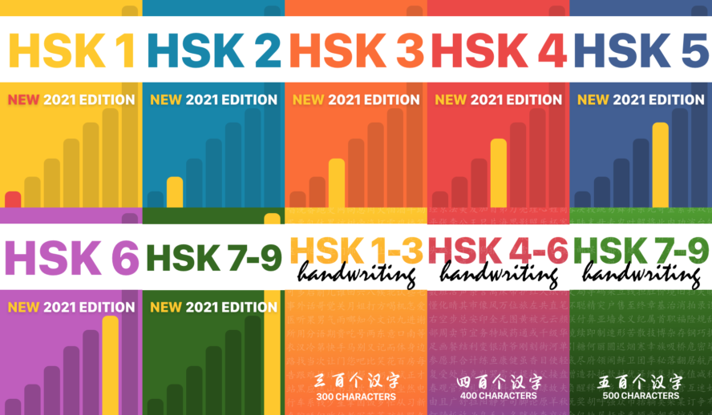

# ml_laoshi

From [wiki](https://en.wikipedia.org/wiki/Written_Chinese):
"*Chinese characters do not constitute an alphabet or a compact syllabary. Rather, the writing system is roughly logosyllabic; that is, a character generally represents one syllable of spoken Chinese and may be a word on its own or a part of a polysyllabic word.*"

In another words, the chinese writing system is relatively difficult to learn (relative to latin-script alphabet (a.k.a. English), cyrilic-script (a.k.a Russian), greek alphabet, ...) and requires thorough memorization throughout the learning process. To aid the learning process, non-native learners rely on HSK (Hanyu Shuiping Kaoshi => Chinese Proficiency Test) which guides the student through several levels of profficiency.

Every level grows the vocabulary of chinese words, thus symbols, in a thematic way, exploring topics such as *office meeting*, *shopping for clothes*, *visit to hospital*, ... . Altough this is may seem as a reasonably systematic appraoch, it heavily relies on memorization, rather than intuitive learning. 

To understand the learning of chinese characters, one needs to understand what a symbol-based alphabet means:

- words consists of set of symbols, a symbol consists of radicals (sub-symbols)
    - give an example here
- symbols with different meanings may have same pronounciation (very common)
    - also an example here 
- meaning is tied to both written language (unique symbols) and spoken language (same or similarly sounding pronounciation)

Therefore, learning to write chinese language is hugely important to be proficient in it. An important feature of HSK is that it establishes a stable set of symbols, which are required to pass the exam.

Too Long Didin't Read:
Learning chinese requires learning a pre-defined set of symbols provided by HSK learning guide. Symbols relate to each other by the way they are written (symbols consists of radicals), the way they are pronounced (pronounciation of different symbols symbols is often similar) and by their meaning (sparsely related to the way the symbols are written and pronounced). In another words, the process of learning chinese requires memorizaton. Context simplifies memorization by aiding the brain to uptake loose connections among the learned content, streghtening the retrieval of the content in various situations. The purpose of this project is to visualize these loose connections as graphs. The connections include all 3 layes: 
- shape of the symbol
- pronounciation of the symbol
- meaning of the symbol 

Each of the 3 layers contains its own graph where the interconnections among the layers is the learned vocabulary (symbol+pronounciation+meaning), but with many loose connection providing contex.

It is up to this project to explore these connections and thus explore effective ways to aid the process of learning Chinese.

 
